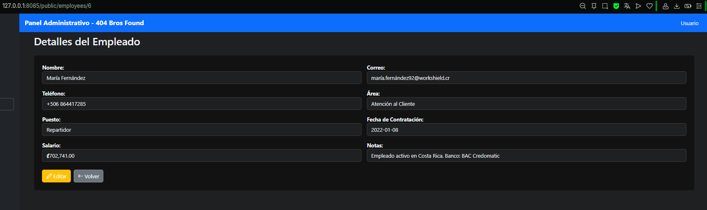
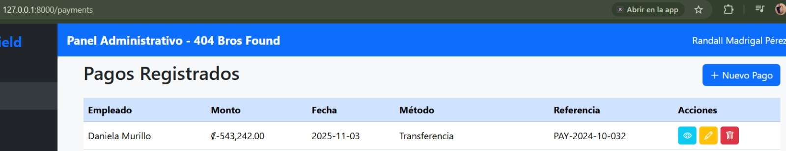

# WorkShield 
**Proyecto:** WorkShield (404 Bros Found)  
**Curso:** ITI-922 — Seguridad de TI II  
**Integrante:** Randall Madrigal Pérez y Cristopher Matus Salas

---

## 1. Descripción del proyecto

### Propósito de la aplicación
WorkShield es una aplicación web desarrollada para prácticas de seguridad informática y gestión de RRHH. Permite gestionar empleados (crear, listar, ver detalle, editar, eliminar). El objetivo de este repositorio es servir como **proyecto de prueba** para implementar, explotar y documentar vulnerabilidades OWASP con fines educativos.

### Tecnologías utilizadas
- **Framework:** Laravel 11 (PHP 8.4)  
- **Frontend:** Blade templates + Bootstrap 5 (responsive) + JavaScript  
- **Base de datos:** MySQL 8  
- **Servidor de desarrollo:** php artisan serve (http://127.0.0.1:8000)  

### Arquitectura general
Aplicación MVC (Models, Views, Controllers) típica de Laravel:
- `app/Models` → Modelos Eloquent (Employee, Role, Payment, Audit, User).  
- `app/Http/Controllers` → Lógica CRUD y endpoints.  
- `resources/views` → Vistas Blade (UI en español).  
- `database/migrations` y `database/seeders` → Estructura y datos iniciales.

---

## 2. Instrucciones de despliegue

### Requisitos previos
- PHP >= 8.4  
- Composer >= 2.0 
- MySQL >= 8.0   
- Git
- Xampp 8.2.12 / PHP 8.2.12
### Pasos detallados de instalación
1. Tener la terminal en:
   ```bash
   \WorkShield>
    ````

2. Instalar dependencias PHP:

   ```bash
   composer install
   ```
3. Copiar el archivo de entorno y generar key:

   ```bash
   cp .env.example .env
   php artisan key:generate
   ```
4. Configurar `.env` con los datos de la base de datos:

   ```
   DB_CONNECTION=mysql
   DB_HOST=127.0.0.1
   DB_PORT=3306
   DB_DATABASE=workshield
   DB_USERNAME=root
   DB_PASSWORD=
   ```
5. Importar base de datos:
   En Xampp tener corriendo Apache y MySQL, entrar en admin de MySQL e importar la bd llamada workshield_db.sql que se encuentra en la carpeta del proyecto.
6. Ejecutar migraciones:

   ```bash
   php artisan migrate
   ```
7. Iniciar servidor local:

   ```bash
   php artisan serve
   ```

   Abre: `http://127.0.0.1:8000`

### Configuración de base de datos
---

## 3. Catálogo de vulnerabilidades

### Vulnerabilidad 1 — IDOR (Insecure Direct Object Reference)

* **Nombre:** IDOR (Insecure Direct Object Reference)
* **Clasificación OWASP:** A01:2021 — Broken Access Control

#### i. Descripción técnica

Cada modulo tiene su funcionabilidad CRUD que devuelve la vista de detalles de un empleado, pagos o roles no aplicado autenticación ni verificación de permisos. Cualquiera que conozca o pruebe diferentes valores del parámetro `{id}` puede enumerar y visualizar registros de empleados etc (incluyendo datos sensibles como salario y cuenta bancaria). Esto esta dentro de  **Broken Access Control** porque el acceso a recursos no está restringido por el login o roles.

#### ii. Ubicación en el código

* **Ruta vulnerable:** `routes/web.php`
  * Archivo: `routes/web.php`
  * Linea 37: Route::resource('employees', EmployeeController::class);
* **Controlador:** `app/Http/Controllers/EmployeeController.php`

  * Método: `show($id)`
  * Fragmento codigo linea 63:

    ```php
    public function show($id)
    {
        $employee = Employee::findOrFail($id);
        return view('employees.show', compact('employee'));
    }
    ```
  
#### Pasos detallados para explotar la vulnerabilidad

**Precondición:** servidor en ejecución en `http://127.0.0.1:8000` y base de datos importada.

1. Abrir el navegador.
2. Abrir la URL del endpoint con un id válido:

   ```
   http://127.0.0.1:8000/employees/6
   ```
3. Cambiar el `{id}` por otros valores para enumerar registros:

   ```
   http://127.0.0.1:8000/employees/2
   http://127.0.0.1:8000/employees/3
   ```


#### IMG. Evidencia


#### v. Impacto

* Exposición de datos personales y financieros de empleados.
* Posibilidad de enumerar registros y extraer información confidencial.
* Base para ataques posteriores (ingeniería social, fraudes, etc.).

---
## Vulnerabilidad 2 — Stored XSS (Cross-Site Scripting almacenado)

**Nombre:** Stored XSS (Cross-Site Scripting almacenado)  
**Clasificación OWASP:** A03:2021 — Injection (Cross-Site Scripting)

### i. Descripción técnica

El campo `notes` del modelo `Employee` acepta y almacena texto ingresado por el usuario sin sanitización. La vista de detalle del empleado (`employees.show`) renderiza ese contenido sin escapar, usando `{!! $employee->notes !!}`. Un atacante puede inyectar código JavaScript (por ejemplo `<script>...</script>`) en `notes`. El payload queda persistido en la base de datos y se ejecuta en el navegador de cualquier usuario que visite la vista vulnerable, permitiendo robo de cookies, ejecución de acciones en nombre del usuario, exfiltración de datos, phishing contextual, etc. Esto va de la mano con la Vulnerabilidad de Broken Access Control Anterior.

### ii. Ubicación en el código

**Vista vulnerable:** `resources/views/employees/show.blade.php`

Fragmento vulnerable, linea 46:
```php
<!-- vulnerable: render sin escapar -->
<div class="form-control bg-light">{!! $employee->notes ?? 'Sin notas' !!}</div>
```

**Controlador (almacenamiento sin sanitizar):** `app/Http/Controllers/EmployeeController.php`

Métodos: `store(Request $request)` y `update(Request $request, $id)`

Fragmento  (almacenando `notes` sin sanitizar), linea 91:
```php
$validated = $request->validate([
    // ... otros campos ...
    'notes' => 'nullable|string|max:2000',
]);
```
Linea 95:
```php
// Vulnerable: guardado sin sanitizar
Employee::create($validated); // o $employee->update($validated);
```

### iii. Pasos detallados para explotar la vulnerabilidad (PoC)

**Precondición:** servidor en ejecución en `http://127.0.0.1:8000`.

1. Entrar al login y ya sea con las rutas sin autenticacion o iniciando sesion.

2. Ir a crear o editar empleado:
```
   http://127.0.0.1:8000/employees/create
   # o
   http://127.0.0.1:8000/employees/{id}/edit
```

3. En el campo **Notas**, insertar un payload de prueba:
```html
   <script>alert('XSS PoC - WorkShield')</script>
```

4. Guardar el empleado.

5. Abrir la vista de detalle del empleado:
```
   http://127.0.0.1:8000/employees/{id}
```

6. Verificar la ejecución del payload.

### IMG. Evidencia


### v. Impacto

- Ejecución de JavaScript en el contexto del sitio para cualquier usuario que vea la ficha (persistente).
- Robo de sesiones si las cookies no usan `HttpOnly`.
- Realización de acciones en nombre de la víctima (formularios, cambios, borrados).
- Phishing contextual (formularios falsos en la propia UI) y exfiltración de datos visibles.
- Combinable con otras vulnerabilidades (IDOR, CSRF) para ataques más graves.

---
## Vulnerabilidad 3 — Business Logic Flaw: creación insegura de pagos (A04:2021 Insecure Design)

**Nombre:** Business Logic Flaw — Pagos inseguros (reembolsos / atribución arbitraria)  
**Clasificación OWASP:** A04:2021 — Insecure Design

### i. Descripción técnica

En el flujo de creación/edición de pagos la aplicación confía en datos provenientes del cliente que deberían ser controlados por el servidor. Concretamente, se aceptan montos negativos (`amount < 0`) sin comprobar permisos ni flujo de aprobación (posible reembolso no autorizado), y se permite asignar el campo `created_by` desde el formulario (mass-assignment) lo que permite atribuir una operación a otro usuario (fraude / suplantación interna). Es un fallo de diseño: faltan reglas de negocio y controles de autorización para operaciones financieras. En OWASP 2021 encaja como A04: Insecure Design.

### ii. Ubicación en el código

**Modelo:** `app/Models/Payment.php`

Línea 18 - `$fillable` (incluye `created_by` para la PoC):
```php
protected $fillable = [
    'employee_id',
    'amount',
    'payment_date',
    'method',
    'reference',
    'created_by' // <-- agregado para PoC
];
```

**Controlador:** `app/Http/Controllers/PaymentController.php`

Línea 26 - `store(Request $request)` (acepta `created_by` y `amount` sin `min:0`):
```php
$validated = $request->validate([
    'employee_id' => 'required|exists:employees,id',
    'amount' => 'required|numeric',        // permite negativos
    'payment_date' => 'required|date',
    'method' => 'required|string',
    'reference' => 'nullable|string|max:50',
    'created_by' => 'nullable|integer',    // viene del cliente -> vulnerable
]);

Payment::create($validated);
```

Línea 58 - `update(Request $request, $id)` (permite modificar `created_by` y `amount` negativo):
```php
$validated = $request->validate([
    'employee_id' => 'required|exists:employees,id',
    'amount' => 'required|numeric',        // permite negativos
    'payment_date' => 'required|date',
    'method' => 'required|string',
    'reference' => 'nullable|string|max:50',
    'created_by' => 'nullable|integer',    // viene del cliente -> vulnerable
]);

$payment->update($validated);
```

**Vista:** `resources/views/payments/create.blade.php`

Línea 68 - Formulario de creación: campo `created_by`:
```php
<div class="col-md-6">
    <label for="created_by" class="form-label fw-bold text-danger">ID del creador (solo PoC)</label>
    <input type="number" name="created_by" id="created_by" class="form-control" placeholder="Ej: 1 (otro usuario)">
    <div class="form-text">Permite forzar el ID del usuario que crea el pago (PoC).</div>
</div>
```

**Vista:** `resources/views/payments/edit.blade.php`

Línea 54 - Formulario de edición: campo `created_by`:
```php
<div class="col-md-6">
    <label for="created_by" class="form-label fw-bold text-danger">ID del creador (solo PoC)</label>
    <input type="number" name="created_by" id="created_by" class="form-control" value="{{ $payment->created_by }}" placeholder="Ej: 1 (otro usuario)">
    <div class="form-text">Permite forzar el ID del usuario que crea el pago (PoC).</div>
</div>
```

### iii. Pasos detallados para explotar la vulnerabilidad (PoC)

**Precondición:** servidor en ejecución en `http://127.0.0.1:8000` y base de datos importada. 

1. Loguearse.

4. Ir a **Registrar nuevo pago**:
```
http://127.0.0.1:8000/payments/create
```

5. En el formulario introducir:
   - **Empleado**: id válido
   - **Monto**: `-5000` (monto negativo)
   - **Payment date**: fecha actual
   - **Method**: `Cheque`
   - **Reference**: `POC-BUSINESS-FLAW`
   - **Created_by**: `1` (Solo existe un usuario pero mediante la bd en xampp puede crear otro)

6. Enviar formulario.

7. Verificar que se haya hecho el pago con el monto negativo y 

### IMG. Evidencia


### v. Impacto

- **Fraude financiero:** creación de reembolsos no autorizados sin flujo de aprobación.
- **Suplantación interna:** operaciones atribuidas a otros usuarios (ej. administradores), comprometiendo la trazabilidad y auditoría.
- **Corrupción de balances** y conciliaciones contables que afectan la integridad financiera del sistema.
- Base para fraudes o manipulación contable posterior, permitiendo escalar el ataque.
- Combinable con otras vulnerabilidades (Broken Access Control, XSS) para ataques más complejos.

---

### 5. Impacto

- **Fraude financiero:** creación de reembolsos no autorizados.
- **Suplantación interna:** operaciones atribuidas a otros usuarios (ej. administradores).
- **Corrupción de balances** y conciliaciones contables.
- Base para fraudes o manipulación contable posterior.

## 4. Contribuciones del equipo

### Distribución de tareas

* **Randall Madrigal Pérez** — 
* **Cristhofer Matus Salas** — 
### Estadísticas de commits por integrante

* Randall Madrigal Pérez —
* Cristhofer Matus Salas — 
---
